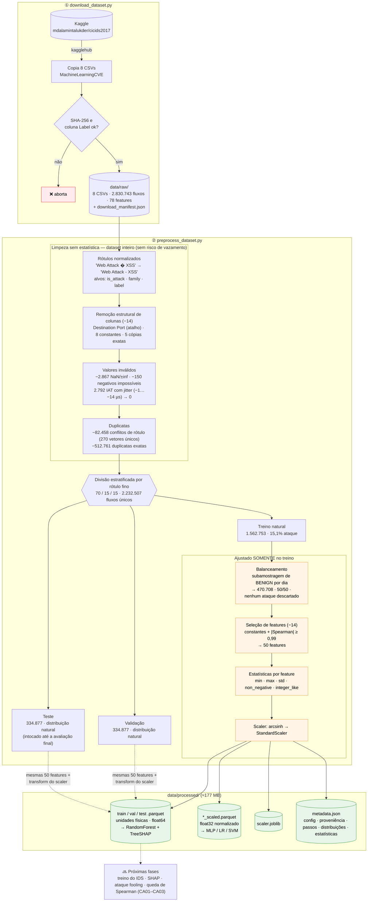
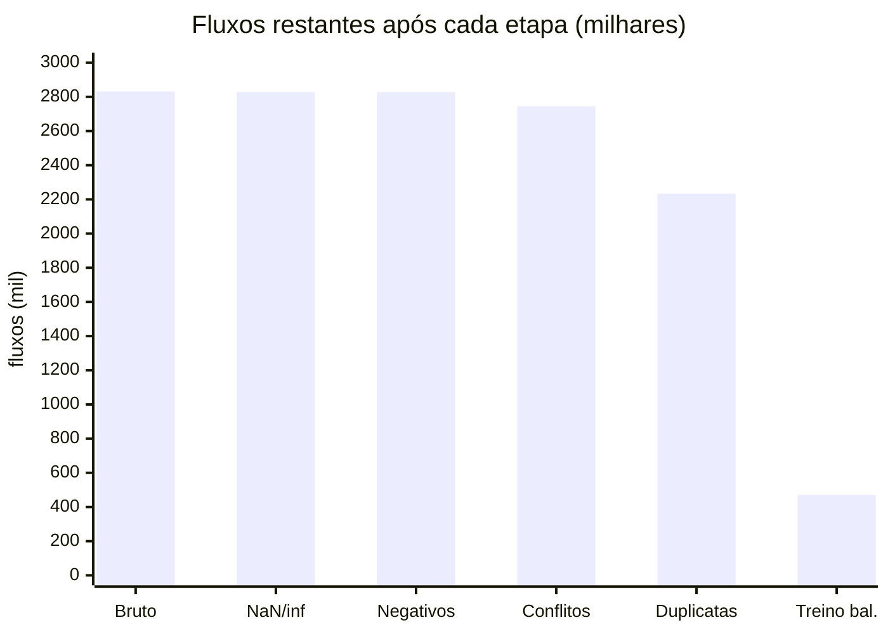

# Fluxo do processamento de dados — CICIDS2017

Infográfico da etapa de dados do projeto **"Auditoria de XAI em Ambientes
Adversariais para Sistemas de Detecção de Intrusão"**. Os números são da
execução com a configuração padrão (`seed=42`) e ficam registrados em
`data/processed/metadata.json`.

> Versões em imagem (para visualizadores sem Mermaid): [`pipeline.png`](pipeline.png)
> e [`funil.png`](funil.png).

## Visão geral

## Funil de linhas

> "Treino bal." é só a parte de treino após o balanceamento; validação e teste
> (334.877 cada) não são balanceados.

## Por que cada decisão

| Etapa | Decisão | Motivo |
| --- | --- | --- |
| Download | Hash SHA-256 fixo por arquivo | Espelhos do CICIDS2017 diferem entre si; garante que todos usem os mesmos bytes. |
| Rótulos | Corrige `�` e agrupa em 9 famílias | Rótulos consistentes; famílias permitem relatório por tipo de ataque. |
| Colunas | Remove `Destination Port` | Identificador que permite "decorar" o laboratório (shortcut); não tem sentido físico perturbá-lo no ataque. |
| Colunas | Remove constantes e cópias exatas | Não trazem informação; cópias dividem a atribuição SHAP arbitrariamente. |
| Valores | Remove NaN/inf e negativos impossíveis; zera jitter de IAT | Erros de medição do CICFlowMeter (Engelen et al., 2021). Zerar o jitter preserva 4 dos 11 Heartbleed. |
| Duplicatas | Remove **antes** da divisão | Impede que o mesmo fluxo esteja no treino e no teste (vazamento). Verificado: 0 vetores em comum. |
| Divisão | Estratificada pelo rótulo fino | Garante ataques raros (Heartbleed, SQL Injection) em todos os conjuntos. |
| Balanceamento | Subamostrar BENIGN, só no treino, sem SMOTE | SMOTE cria fluxos fisicamente inválidos; val/test com distribuição real dão métricas honestas. |
| Features | Spearman ≥ 0,99, ajustado no treino | Árvores são invariantes a transformações monotônicas; redundância embaralharia o ranking SHAP (CA02). |
| Normalização | arcsinh + StandardScaler, ajustado no treino | Caudas pesadas; arcsinh aceita o sentinela −1 e é inversível. RandomForest usa os dados brutos. |
| Formato | Parquet (zstd) + `metadata.json` | Tipado, compacto e rápido; tudo rastreável e reprodutível sem reprocessar. |

## Observação sobre o PortScan

Sem `Destination Port`, a maioria das sondas de PortScan (1 pacote, sem
resposta) fica **idêntica** a fluxos benignos ou entre si, e sai na
deduplicação: de 158.930 linhas restam 1.850 fluxos únicos. Isso é esperado —
uma varredura de portas é um fenômeno de *vários* fluxos, não de um fluxo
isolado. Quem quiser o cenário com a porta pode usar
`--keep-destination-port` (e documentar o risco de atalho).
